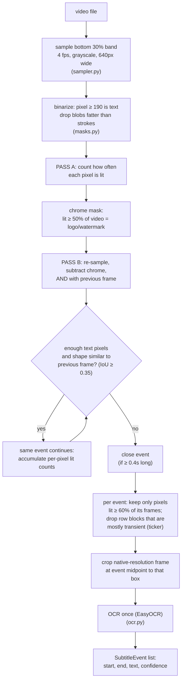
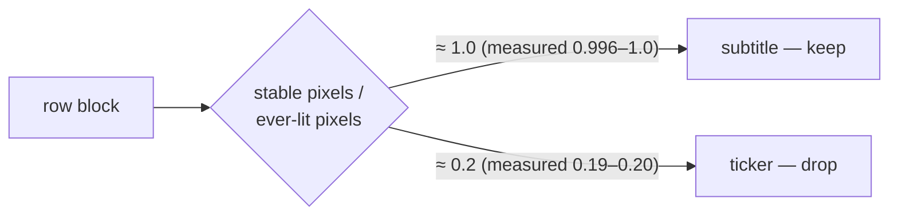

# Stage 1 — Subtitle Event Detection

**What it does:** takes a video with burned-in subtitles and produces the
subtitle track — a list of events, each with a start time, end time, the
text on screen, and an OCR confidence:

```
19.75-21.25  [0.46]  हम सब से नज़रे कैसे मिला पायेंगे?
```

Everything later in the pipeline (audio matching, mismatch flagging, the
report) builds on this track, so Stage 1 has one job: find **exactly** the
subtitles — not the channel logo, not the news ticker, not sparkling
jewellery — and read each one **once**.

No machine learning is involved. The whole stage is pixel counting with
five measured constants, and it runs at roughly 24× realtime on a laptop
CPU.

## The problem in one picture

The bottom of a real TV frame is crowded:

```
│              (video content)                    │
│                                                 │
│        हम सब से नज़रे कैसे मिला पायेंगे?          ← subtitle (want this)
│ [LOGO]                                          ← channel watermark (junk)
│ सूचना: यह कार्यक्रम... ➜ ➜ scrolling ticker ➜ ➜   ← ticker (junk)
└─────────────────────────────────────────────────┘
```

All three are bright text-like pixels. A naive "find bright text at the
bottom" approach reads all of them into one garbled string. Stage 1
separates them **by how they behave over time**, never by where they sit —
so it works regardless of channel layout.

## The core idea: three clocks

Each kind of on-screen text lives on a different timescale:

| Kind | Behaviour over time |
|------|--------------------|
| Channel logo / watermark | lit **the whole video** |
| Subtitle | lit for **a few seconds**, pixels hold still |
| Scrolling ticker | any single pixel lit only **a fraction of a second** |
| Sparkle (jewellery, sequins) | lit for **one frame**, then gone |

So we measure pixel behaviour at three timescales:

1. **Whole video** — a pixel lit in ≥50% of all frames is *chrome*
   (logo, watermark, static disclaimer chip). Erased everywhere.
2. **Frame to frame** — each mask is ANDed with the previous frame's mask.
   Subtitles survive (they persist); sparkle dies (it moves every frame).
3. **Within one event** — a pixel lit in <60% of the event's frames is
   transient (a ticker sweeping past). Only stable pixels define the text
   region we crop for OCR.

## Pipeline flow



Two passes over the video are needed because chrome can only be judged
against the *whole* timeline (pass A), and events are then detected on
chrome-free masks (pass B). Frames stream from an ffmpeg pipe — nothing is
written to disk during detection.

## How the ticker is separated (the subtle part)

A scrolling ticker fails the "60% stable" test almost everywhere — every
pixel is lit only while a letter sweeps past. But Devanagari has the
शिरोरेखा, the horizontal headline stroke running along the top of every
word. Under horizontal scroll that stroke overlaps *itself*, so its pixels
look stable, and a plain stability test leaves a thin bright streak that
still pollutes OCR.

The fix: split the event's lit rows into horizontal blocks (a gap of more
than 6 rows starts a new block), then look at each block's **ratio of
stable pixels to ever-lit pixels**:



A subtitle's pixels are *all* stable. A ticker block is a huge smear of
ever-lit pixels with only the शिरोरेखा streak stable — the ratio collapses.
Cutoff is 0.5, with a factor-of-two margin to both measured sides.

## Module map

All Stage 1 code lives in `subtitle_checker/subtitles/`:

| File | Job |
|------|-----|
| `sampler.py` | ffmpeg plumbing: stream the subtitle band as grayscale frames (detection), extract one native-resolution frame (OCR) |
| `masks.py` | grayscale band → boolean text mask (threshold 190, fat-blob removal), mask IoU |
| `events.py` | the three clocks: chrome presence, frame-pair AND, event state machine, stable-pixel/ticker logic |
| `ocr.py` | `OcrEngine` Protocol + `EasyOcrEngine` (lazy import, models load on first use) |
| `reconstruct.py` | orchestration: pass A → pass B → crop → OCR once per event → `SubtitleEvent` list |

`subtitle_checker/evaluation/detection.py` closes the loop (see below).

## The constants, and where each number comes from

Every constant was set by a measured failure on real footage, not by
guessing:

| Constant | Value | Meaning | Origin |
|----------|-------|---------|--------|
| `DEFAULT_THRESHOLD` | 190 | pixel brightness that counts as text | white fill ≈255, yellow karaoke highlight ≈226, scene rarely sustains ≥190 in the band |
| `CHROME_PRESENCE` | 0.5 | lit fraction of whole video ⇒ chrome | TATA PLAY watermark leaked into OCR |
| `SAME_EVENT_IOU` | 0.35 | mask overlap that still counts as the same subtitle | karaoke highlight nudges the mask; a text change replaces most of it |
| `MIN_TEXT_PIXELS` | 120 | fewer lit pixels ⇒ no subtitle present | noise floor |
| `MIN_EVENT_S` / `MAX_EVENT_S` | 0.4 / 15.0 | events shorter are blips, longer are disclaimers | sampling floor / persistent-text screen |
| `STABLE_PIXEL_FRACTION` | 0.6 | lit fraction of event ⇒ pixel belongs to the subtitle | scrolling ticker fragments events |
| `MIN_CLUSTER_STABILITY` | 0.5 | row block stable/ever-lit ratio below ⇒ ticker, drop | subtitles measure 0.996–1.0, ticker 0.19–0.20 on real footage |
| `ROW_CLUSTER_GAP` | 6 | row gap (detection px) that splits text blocks | wrapped subtitle lines sit closer than subtitle sits to ticker |

Two ffmpeg details matter and are easy to break:

- Band scaling uses `flags=neighbor`. Bilinear scaling averages thin
  anti-aliased strokes below the 190 threshold and text silently vanishes.
- Detection runs at 4 fps on a 640px-wide band. That fixes the timing
  resolution at ±0.25s — good enough for matching against speech.

## How to check it still works

Two commands. First, run on a real video:

```
subtitle-checker check --video path/to/video.mp4 --lang hi
```

Prints every event and writes `<stem>_subtitle_events.json`. Eyeball: real
subtitle lines present, no ticker text or logo characters mixed in.

Second, the closed-loop evaluation — the real safety net:

```
subtitle-checker eval-detection --clean-clip path/to/clean_clip.mp4 --lang hi
```

This burns **known** Hindi lines onto a clip that has no subtitles (ffmpeg
+ libass), runs Stage 1 on the result, and scores detection against the
truth it just burned. Because we authored the truth, recall, timing error
and OCR similarity are exact — no hand labelling.

Reference numbers on real footage (a clean 60s segment of a broadcast
episode **with a live news ticker running below**):

- recall **8/8**, **0** stray events
- mean timing error **0.25s** (= the 4 fps sampling floor)
- mean truth-vs-OCR similarity **0.944**

If a change moves these numbers down, it broke something real. There are
also unit + integration tests (`pytest -q`), including a burn-and-detect
round trip.

## Known limitations (documented, deliberate)

- **Credits, promos, static disclaimer chips** that behave exactly like a
  subtitle (bright, still, a few seconds) are detected as events. Correct
  for Stage 1 — they *are* on-screen text. Stage 3 decides against the
  audio whether text belongs there.
- **Sparkle inside the text box** (e.g. jewellery right next to a
  subtitle) occasionally pollutes OCR. Confidence drops and flags it.
- **Sparkle-only events** on ornate footage come out with confidence ≈0 —
  filterable downstream, kept because "something bright was there" is
  information.
- OCR on **hard backgrounds** (bright clothing, glare) gives honestly low
  confidence rather than clean text; the matcher treats low confidence as
  "unreliable", not as truth.
- Karaoke word-highlighting is handled by design (masks compare *shape*,
  not colour), but footage validation so far covers plain-white subtitles;
  a karaoke-highlighted clip should be re-verified when available.

## Extending

- **Different OCR engine:** implement the two-line `OcrEngine` Protocol in
  `ocr.py` (`read(band) -> (text, confidence)`) and pass it to
  `reconstruct_subtitles(engine=...)`. Nothing else changes.
- **Different language:** `--lang` reaches EasyOCR directly. The detection
  clocks are script-agnostic; only the ticker ratio rule was tuned on
  Devanagari and should be re-measured for a new script.
- **Tuning constants:** change them in `events.py` / `masks.py`, then run
  `eval-detection` before and after. The numbers decide, not intuition.
