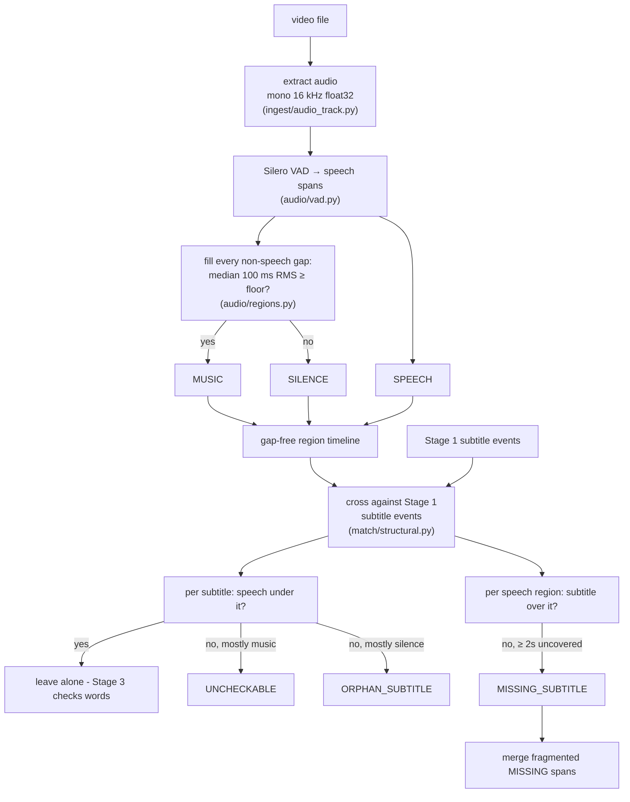
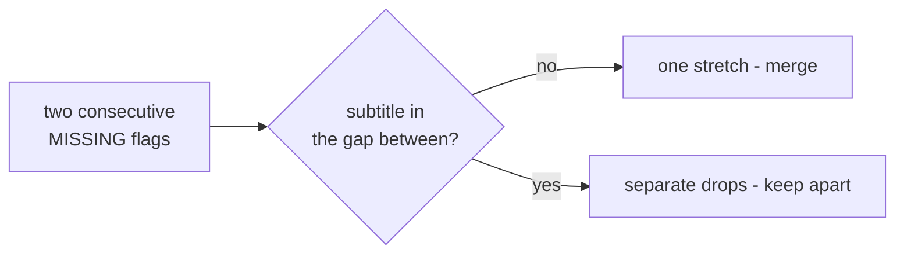

# Stage 2 - Audio Regions & Structural Checks

**What it does:** takes the same video, ignores the picture, and produces a
gap-free timeline of what the **audio** is doing - speech, music, or silence -
then crosses it against the Stage 1 subtitle track to flag the mismatches that
need no word recognition at all:

```
SPEECH   12.0-18.5
MUSIC    18.5-24.0
SPEECH   24.0-31.2
...
MISSING_SUBTITLE   37.0-42.0   speech present, no subtitle on screen
ORPHAN_SUBTITLE     7.25-9.25   subtitle present, no speech beneath it
UNCHECKABLE        44.0-49.0   subtitle over music - maybe sung, can't tell
```

This is the cheapest, most robust signal in the whole tool. It never reads a
word of audio or a character of text - it only asks *is someone speaking here,
and is there a subtitle here?* Getting those two timelines to line up catches a
dropped line or a stray subtitle before any ASR or alignment runs.

Verifying that the subtitle's **words** match the speech is Stage 3's job. Stage
2 only decides whether a subtitle *should* exist at all.

## The problem in one picture

Two independent timelines have to be laid side by side:

```
audio:   ░░ SPEECH ░░   ~music~   ░░ SPEECH ░░░░░░░░░░   ~~silence~~
subs:    [ line 1 ]                [ line 2 ][ line 3 ]
                                                        ▲
                                          speech here, no subtitle → MISSING
```

Three things can go wrong, and only two are real errors:

| Situation | Verdict | Why |
|-----------|---------|-----|
| Speech with no subtitle over it | **MISSING_SUBTITLE** | a line was dropped |
| Subtitle over silence | **ORPHAN_SUBTITLE** | a stray/mistimed subtitle |
| Subtitle over music, no speech | **UNCHECKABLE** | might be sung - abstain, don't accuse |

The whole design rule is **precision first**: a false flag wastes an editor's
time and erodes trust, so when the tool cannot be sure (a subtitle sitting over
a musical passage that *might* be sung dialogue) it says "can't tell" rather
than guessing "wrong".

## The core idea: one gap-free timeline

A VAD (voice activity detector) only tells us where speech is. That leaves
holes. If a subtitle lands in a hole, we still need an answer for "what's under
it?" - so Stage 2 fills every hole:

1. **Silero VAD** marks the speech spans.
2. Every remaining gap is measured for energy and labelled **MUSIC** (loud
   enough - a score, a song) or **SILENCE** (quiet).
3. The result covers the track end to end with no gaps, so any subtitle
   timestamp always maps to exactly one audio kind.

Energy is the **median** RMS over 100 ms windows, not the mean - a single
transient (a door slam, a clap) would spike the mean and mislabel a silent gap
as music. The median ignores one-off spikes.

> **SONG is deliberately not emitted.** Separating sung vocals from a backing
> score needs source separation (the optional Demucs step). Emitting a label we
> can't yet stand behind would be dishonest - so a subtitle over music becomes
> UNCHECKABLE, not a confident SONG verdict.

## Pipeline flow



Two directions are checked independently. Walking the **subtitles** finds
orphans and uncheckables; walking the **speech regions** finds missing lines.

## The verdict rules, and why each threshold exists

Every number was set by a measured false alarm on real footage, not a guess.

**A subtitle is cleared** (no flag) if at least `SPEECH_COVER_MIN = 0.3` of its
span overlaps speech. Low on purpose - any real dialogue under it means Stage 3
should judge the words, not Stage 2.

**With no speech under it**, the subtitle is `UNCHECKABLE` if `MUSIC_COVER_MIN =
0.5` or more of its span is music (benefit of the doubt - maybe sung),
otherwise `ORPHAN_SUBTITLE` (it sits over silence).

**A speech region flags MISSING** only for an uncovered stretch of at least
`MIN_UNCOVERED_SPEECH_S = 2.0` seconds. A real dropped line is a whole
utterance; anything shorter is a breath, a between-lines pause, or VAD jitter.

**Each subtitle is padded by `COVER_PAD_S = 0.5`** before coverage is measured.
Consecutive subtitles blink off for a fraction of a second while the speech runs
on; without this pad every line transition would read as a gap in coverage and
fire a false MISSING. This one constant took the first Mann Atisunder run from
**13 false MISSING flags to 0**.

## Merging fragmented MISSING flags (the subtle part)

One unsubtitled stretch of speech does not arrive as one clean region. The VAD
breaks it on every breath or bar of background music, so a single dropped line
splits into several MISSING flags:

```
speech:  ░░░░░  ~music~  ░░░░░░░   ← one unsubtitled stretch, VAD split in two
flags:   MISSING          MISSING   ← reads as two errors, is really one
```

The fix collapses consecutive MISSING flags into one span - **unless a subtitle
sits in the gap between them**. A subtitle in the gap means the two stretches
are genuinely separate drops with real coverage between them, so they stay
apart. Nothing in the gap means it is one continuous unsubtitled stretch, so
they merge. This is a structural rule, not a time threshold, so it can't
accidentally join two real drops that happen to be close.



On the two Dangal full episodes this cut the raw flag count from **39 to 24**
and **54 to 13**, with no change to precision or recall.

## Module map

| File | Job |
|------|-----|
| `ingest/audio_track.py` | ffmpeg → mono 16 kHz float32 numpy (writable copy - torch warns on read-only views) |
| `audio/vad.py` | `VoiceActivityDetector` Protocol + `SileroVad` (lazy torch import, model loads on first use) |
| `audio/regions.py` | VAD spans + energy-labelled gaps → one gap-free `AudioRegion` timeline |
| `match/structural.py` | cross subtitles × regions → `CheckResult` flags; merge fragmented MISSING |
| `evaluation/structural_eval.py` | closed-loop scoring (see below) |

The VAD sits behind a Protocol for the same reason Stage 1's OCR does: tests run
a `FakeVad` and CI never loads the torch model. Silero is an optional extra
(`pip install .[audio]`); if it's absent, `check` skips Stage 2 with a clear
message instead of crashing.

## The constants, and where each number comes from

| Constant | Value | Meaning | Origin |
|----------|-------|---------|--------|
| `MUSIC_RMS_FLOOR` | 0.015 | median 100 ms RMS above ⇒ music, below ⇒ silence | tuned on the Hindi clips; no true silence in continuous-score serials |
| `SPEECH_COVER_MIN` | 0.3 | subtitle/speech overlap that clears a subtitle | any real dialogue under it defers to Stage 3 |
| `MUSIC_COVER_MIN` | 0.5 | music overlap that makes a speechless subtitle UNCHECKABLE not ORPHAN | benefit of the doubt to "maybe sung" |
| `MIN_UNCOVERED_SPEECH_S` | 2.0 | shortest uncovered speech worth a MISSING flag | on Mann every sub-2s "gap" was a false alarm at a line boundary |
| `COVER_PAD_S` | 0.5 | grace added to each subtitle span before measuring coverage | subtitles blink off between lines; 13 false flags → 0 |

## How to check it still works

Run the full pipeline on a real video (Stage 1 + Stage 2 together):

```
subtitle-checker check --video path/to/video.mp4 --lang hi
```

Prints every structural flag and writes `<stem>_audio_regions.json` +
`<stem>_check_results.json`. Eyeball: no MISSING flags on a fully-subtitled
clean serial, UNCHECKABLE (not ORPHAN) over songs.

The closed-loop evaluation is the real safety net:

```
subtitle-checker eval-structural
```

It plants **known** defects - drops a real line, adds an unspoken extra line -
onto truth-built timelines, runs the structural check, and scores each verdict
against the defect it planted. Because we authored the defect, precision and
recall are exact.

Reference numbers:

- **eval-structural:** recall **2/2**, precision **1.00** (0 false flags), both
  verdicts (drop_line → MISSING, extra_line → ORPHAN) correct.

## Real-footage validation (the 6-clip Hindi sweep)

Stage 2 was run through `check` on all six Hindi clips. The headline result:
**zero true false positives, no tuning needed.**

| Clip | Length | Events | Result |
|------|--------|--------|--------|
| Mann Atisunder | 31s | 13 | **0 flags** (clean serial) |
| Kahani Pahle Pyar Ki | 30s | 9 | 1 MISSING (near-clean) |
| Gatha Shiv Parivaar | 1min | 18 | **6 UNCHECKABLE, 0 MISSING/ORPHAN** (song → abstain, exactly right) |
| Pushpa Impossible | 1min | 15 | 1 UNCHECKABLE (near-clean) |
| Dangal SLS 1 | 11.6min | 174 | 24 MISSING + 80 UNCHECKABLE |
| Dangal SLS 2 | 10.8min | 100 | 13 MISSING + 32 UNCHECKABLE |

The Dangal floods are **not** logic errors. Both files are full broadcast
episodes containing an unsubtitled half, end-credits cards, and a सूचना
disclaimer intro. Frames sampled at the MISSING midpoints show dramatic dialogue
scenes with genuinely no burned-in subtitle - the detector is correctly seeing
speech-with-no-subtitle on unsubtitled content. The UNCHECKABLE floods are
Stage 1 chrome leakage (animated Free Dish logo, scrolling disclaimer, credits)
landing over music, then correctly abstained on. No false ORPHAN anywhere.

The real-footage true positives were proven directly: on a clean serial, drop a
real line → MISSING fires on its real speech; add an unspoken line over a music
region → UNCHECKABLE, not a false ORPHAN. All three structural paths verified on
real audio.

## Known limitations (documented, deliberate)

- **Full episodes with unsubtitled stretches** (credits, promos, unsubtitled
  scenes) generate many MISSING flags - each one *correct*, but it raises a
  design question: should the tool flag every unsubtitled spoken second, or does
  it assume it runs on already-subtitled content? This needs a product decision
  (a program-region gate) before it's built - **open question for the mentor**,
  deliberately not guessed at here.
- **SONG is not distinguished from MUSIC** - needs source separation. Until
  then a subtitle over music is UNCHECKABLE, an honest abstention.
- **Chrome that leaks past Stage 1** (animated logos, scrolling tickers landing
  over music) becomes UNCHECKABLE rather than a false flag - the abstention
  contains the damage from bad Stage 1 input.
- **`MUSIC_RMS_FLOOR` is a single global energy threshold** tuned on the Hindi
  clips. A very quiet score or a very loud silence could cross it; re-measure
  for new content with `eval-structural` before trusting it.

## Extending

- **Different VAD:** implement the one-line `VoiceActivityDetector` Protocol in
  `vad.py` (`speech_spans(audio) -> [(start, end), ...]`) and pass it to
  `label_regions(vad=...)`. Nothing else changes.
- **Source separation (SONG):** the `SONG` enum value already exists in
  `artifacts.py`. Adding a Demucs step that splits vocals from score lets
  `label_regions` emit SONG, at which point subtitles over song become
  checkable instead of UNCHECKABLE.
- **Tuning constants:** change them in `regions.py` / `structural.py`, then run
  `eval-structural` before and after. The numbers decide, not intuition.
