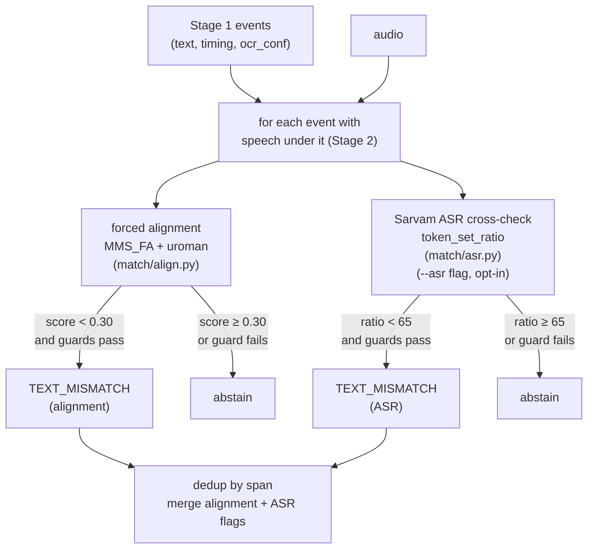

# Stage 3 — Text Mismatch Detection

**What it does:** takes the subtitle text Stage 1 read and the audio Stage 2
labelled, and asks the harder question: were *these exact words* spoken here?

Two signals, layered in order of cost and reliability:

1. **Forced alignment** (primary) — score the known subtitle words against the
   audio without transcribing anything open. A low score means those words were
   not spoken in that window.
2. **ASR cross-check** (secondary, opt-in) — transcribe the audio with Sarvam
   Saarika and compare word-for-word to the subtitle. Catches gross divergences
   alignment's single score cannot separate.

Both produce `TEXT_MISMATCH` verdicts. The report surfaces *heard-vs-written*
for every line so the editor can catch the subtle word errors neither signal
auto-flags.

## Why forced alignment, not open ASR

Open ASR (Whisper) was the first approach. On PlanetRead's own Hindi clips it
was unusable: Tamil-script output on Hindi audio, hallucination loops on
music-heavy segments, garbled Devanagari on background-score content. The root
cause is structural — open transcription asks "what was said?" on noisy Indian
broadcast audio that LLM-trained models were not built for.

Forced alignment inverts the question: "was *this line* spoken here?" The
subtitle text is already known and trustworthy (Stage 1 OCR). The aligner does
not have to produce a transcript — it just scores whether the known words fit the
audio. That sidesteps the entire hallucination failure class.

```
open ASR  → "what was said?" → hallucination, wrong script, music loops
alignment → "was THIS here?" → score the known words; no open generation
```

## The alignment signal (primary)

The aligner is a CTC model — `torchaudio`'s MMS_FA bundle, which covers Hindi,
Marathi, and Kannada. It maps each known word to a position in the audio and
returns a confidence score per frame. The frame-weighted mean becomes the event
score.

MMS aligns romanized text, so the concrete implementation transliterates
Devanagari with `uroman` before scoring. The transliteration step is the known
risk (sandhi and proper nouns romanise badly); it lives inside `MmsAligner`,
not in the pure scorer, so a script-native aligner could be dropped in without
touching anything else.

**Score bands measured on real Hindi footage:**

| Situation | Score range |
|-----------|-------------|
| Correct dialogue, clean audio | 0.60 – 0.75 |
| Correct dialogue, heavy background score | ~0.375 |
| Wrong line (gross mismatch) | 0.21 – 0.29 |

The gap between correct (0.60+) and wrong (≤0.29) is clean on clear audio.
On heavy-score audio the gap shrinks — a wrong line on Mann Atisunder scored
0.32 against a correct-line baseline of 0.375, which is below the detection
threshold. That is the **hard limit** of alignment on this content, not a bug.
Source separation (Demucs) is the fix path; until then, Sarvam covers the gap.

### Why the window is kept tight

`WINDOW_PAD_S = 0.2` — only 200 ms of grace on each side of the subtitle span.
A wider window feeds the aligner speech that belongs to neighbouring lines.
Those extra words must then *also* be covered by the subtitle's text, which
drags the score down on correct lines and produces false flags. Stage 2 pads
generously to bridge subtitle blinks; alignment wants the true onset, so it
pads as little as possible.

### Precision guards

A verdict fires only when all four conditions hold:

| Condition | Value | Reason |
|-----------|-------|--------|
| speech under the subtitle | (from Stage 2) | no point aligning over music or silence |
| OCR confidence ≥ | `MIN_OCR_CONF = 0.5` | garbled OCR text aligns badly even when audio is correct; abstain rather than false-flag |
| subtitle span ≥ | `MIN_MISMATCH_SPAN = 1.5 s` | short stings carry too few words for the score to be reliable |
| alignment score < | `TEXT_MISMATCH_MAX = 0.30` | flags gross divergence only; correct lines comfortably clear 0.60 |

When any guard fails the event is skipped silently — no UNCHECKABLE noise
added on top of Stage 2's.

## The ASR cross-check (secondary)

Forced alignment is a single mean score per event. A single wrong word barely
moves that mean — measured on real footage, swapping one word shifts the score
by only ~0.06 (e.g. Dangal SLS2: correct 0.63 → wrong 0.56), well within
clip-to-clip variance. Single-word errors are the **Sarvam cross-check's job**.

Sarvam Saarika (`saarika:v2.5`) transcribes the audio window, then
`token_set_ratio` (from rapidfuzz) compares the transcript to the subtitle.
`token_set_ratio` is order-insensitive, which suits Indic word-order drift and
the fact that OCR and ASR tokenise a little differently (e.g. `पीया` vs `पिया`).

**Threshold calibration from live Sarvam data (Dangal SLS2, real audio):**

| Situation | token_set_ratio |
|-----------|----------------|
| Correct lines | 82 – 100 |
| Single word swapped | 75 – 93 |
| Gross divergence (wrong line) | ~30 |

Single-word swaps overlap with correct lines at the 75–93 level because OCR
and ASR already disagree ~15% on spelling and word order even on a correct
line. `MIN_TOKEN_RATIO = 65` flags only gross divergences; single-word errors
sit above the cut and are not auto-flagged. They are surfaced as
*heard-vs-written* in the Stage 4 report so the editor can judge them.

> **This is not a limitation to paper over.** The tool's honest claim is:
> auto-flag gross errors + give the editor heard-vs-written so *they* catch
> subtle word errors. Claiming word-level auto-detection would be wrong.

The check is opt-in (`--asr` flag) because it costs API calls. When the key is
absent the CLI skips Stage 3b and prints a clear message. Deduplication prevents
a line from appearing in both alignment and ASR flags.

### Complementarity — the key finding

Alignment and Sarvam cover different failure modes:

| Signal | Strength | Blind spot |
|--------|----------|-----------|
| Forced alignment | silent (no API), works on clean audio | heavy background score compresses the gap |
| Sarvam ASR | recovers dialogue from score-heavy audio | costs API credits; single-word noise floor |

Tested on Mann Atisunder (the hardest clip — continuous heavy background score):
alignment scored a wrong line at 0.32 vs baseline 0.375 and missed it; Sarvam
still recovered the content words even through the score. The two signals are
genuinely complementary, not redundant.

## Pipeline flow



## Module map

| File | Job |
|------|-----|
| `match/align.py` | `ForcedAligner` Protocol + `MmsAligner` (MMS_FA + uroman); pure `score_events` / `score_event` |
| `match/asr.py` | `AsrEngine` Protocol + `SarvamAsr` (Saarika v2.5, key from env only); `check_asr` |
| `match/verdicts.py` | `check_alignment` — score → precision-guarded `CheckResult` list |
| `evaluation/alignment_eval.py` | measures correct-vs-wrong-line score separation on real clips |
| `match/structural.py` | `event_has_speech` extracted here — shared by both Stage 3 modules |

Both engines sit behind Protocols for the same reason Silero and EasyOCR do:
tests run fake implementations, CI never touches a model or an API. Extras
needed: `pip install .[align]` for MMS, `pip install .[asr]` for Sarvam.

## The constants

| Constant | Value | Source |
|----------|-------|--------|
| `WINDOW_PAD_S` (alignment) | 0.2 s | tight — wide window drags score on correct lines |
| `WINDOW_PAD_S` (ASR) | 0.3 s | slightly wider — Sarvam benefits from a little more context |
| `TEXT_MISMATCH_MAX` | 0.30 | measured gap between correct (0.60+) and wrong (0.21–0.29) |
| `MIN_OCR_CONF` | 0.5 | gate against garbled OCR |
| `MIN_MISMATCH_SPAN` | 1.5 s | short stings unreliable for alignment |
| `MIN_TOKEN_RATIO` | 65.0 | live-calibrated on Dangal SLS2; gross divergence ~30, correct 82–100 |

## How to run it

Alignment runs automatically in `check` (no flag needed, no API cost):

```
subtitle-checker check --video path/to/video.mp4 --lang hi
```

Add `--asr` to also run the Sarvam cross-check (needs `SARVAM_API_KEY` in env):

```
SARVAM_API_KEY=$(security find-generic-password -s sarvam-api-key -w) \
  subtitle-checker check --video path/to/video.mp4 --lang hi --asr
```

To measure how well alignment separates a correct line from a wrong one on
real footage:

```
subtitle-checker eval-alignment
```

Unlike `eval-structural`, this uses real audio (CTC alignment needs real
speech) — it trusts high-OCR-confidence events as ground truth and compares
their scores to one-word-swapped versions.

## Real-footage results

**Dangal SLS2 (clean audio)** — 100 events:
- Correct lines: mean score 0.626, token_set_ratio 82–100
- Injected wrong line: score 0.21 → `TEXT_MISMATCH` caught, 0 false flags

**Pushpa Impossible (clean, ornate backgrounds)** — 15 events:
- Correct lines: 0.69 / 0.75, Sarvam ratio 85–100
- OCR-garbled events (low conf): abstained via `MIN_OCR_CONF` guard — 0 false flags

**Mann Atisunder (heavy background score)** — 13 events:
- Correct lines: ~0.375 (score compressed by the score)
- Injected wrong line: 0.32 — **NOT caught** by alignment (gap too small)
- Sarvam: recovered content words, would surface as low ratio

**All 6 Hindi clips combined:** 0 false TEXT_MISMATCH flags on clean content.

## Known limitations

- **Single-word errors cannot be auto-flagged** — they sit below the OCR↔ASR
  noise floor (~15% natural divergence). The Stage 4 report surfaces
  *heard-vs-written* per line so editors catch them manually.
- **Heavy background score compresses alignment scores** — correct and wrong
  lines get closer. Demucs source separation (vocals vs score) is the fix;
  until then Sarvam bridges the gap.
- **Sarvam usage costs credits** — 2000 credits available, ~30 credits per
  hour of transcription. The tool transcribes one short window per trusted
  event, so even a full episode costs well under 1 credit-hour. Use `--asr`
  deliberately.
- **CTC constraint** — an event whose text is longer than the window's audio
  span crashes `forced_align`. The aligner catches this, returns `None`, and
  the event is silently abstained. Short-window events with long text (fast
  speech on a brief clip) will never get an alignment verdict.

## Extending

- **Different aligner:** implement `ForcedAligner` in `align.py`
  (`align(audio, text) -> list[WordSpan]`) and pass it to `score_events`.
  Nothing else changes. A native-Devanagari aligner would remove the uroman
  transliteration step entirely.
- **Different ASR engine:** implement `AsrEngine` in `asr.py`
  (`transcribe(audio) -> str`) and pass it to `check_asr`. Whisper is an
  obvious candidate for offline use (with lower accuracy on this content).
- **Fusion:** currently alignment and ASR flags are unioned and deduped by
  span. A future enhancement could combine them (low score AND low ratio →
  higher confidence verdict) — the data contracts already support it.
